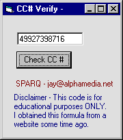



## A Credit Card Validator \- NEW\!\!

### Description

To Check a Credit Card number for TYPE and VALIDITY

*** PLEASE RATE ***
 
### More Info
 
The Credit Card Number

TYPE of card and VALIDITY of Number

             |
---                |---
**Submitted On**   |2000-05-23 10:46:10
**By**             |[Sparq](https://github.com/Planet-Source-Code/PSCIndex/blob/master/ByAuthor/sparq.md)
**Level**          |Intermediate
**User Rating**    |4.3 (26 globes from 6 users)
**Compatibility**  |VB 3\.0, VB 4\.0 \(16\-bit\), VB 4\.0 \(32\-bit\), VB 5\.0, VB 6\.0, VB Script, ASP \(Active Server Pages\) 
**Category**       |[Miscellaneous](https://github.com/Planet-Source-Code/PSCIndex/blob/master/ByCategory/miscellaneous__1-1.md)
**World**          |[Visual Basic](https://github.com/Planet-Source-Code/PSCIndex/blob/master/ByWorld/visual-basic.md)
**Archive File**   |[CODE\_UPLOAD60265232000\.zip](https://github.com/Planet-Source-Code/sparq-a-credit-card-validator-new__1-8259/archive/master.zip)

